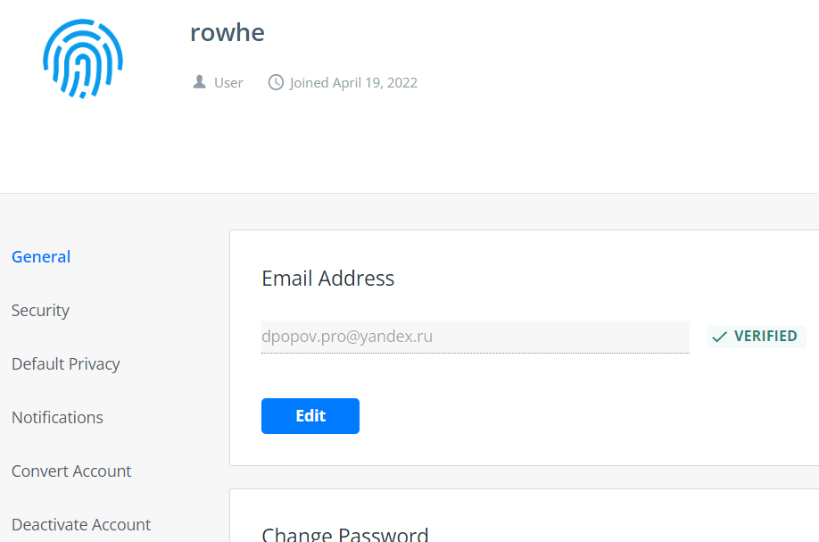
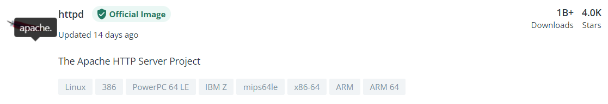

# Домашнее задание к занятию "5.3. Контейнеризация на примере Docker"

## Задача 1 

Посмотрите на сценарий ниже и ответьте на вопрос:
"Подходит ли в этом сценарии использование докера? Или лучше подойдет виртуальная машина, физическая машина? Или возможны разные варианты?"

Детально опишите и обоснуйте свой выбор.
  * C указанными приложениями и сервисами мне работать не приходилось, поэтому могу только догадываться о целесообразности применения контейнеризации в каждом из указанных сценариев.
--

Сценарий:

- Высоконагруженное монолитное java веб-приложение;
  * Лучше использовать виртуальную машину
- Go-микросервис для генерации отчетов;
  * Подойдет докер-контейнер
- Nodejs веб-приложение;
  * Докер-контейнер
- Мобильное приложение c версиями для Android и iOS;
  * Контейнер
- База данных postgresql используемая, как кэш;
  * Контейнер
- Шина данных на базе Apache Kafka;
  * Можно применить контейнеризацию
- Очередь для Logstash на базе Redis;
  * Контейнер
- Elastic stack для реализации логирования продуктивного веб-приложения - три ноды elasticsearch, два logstash и две ноды kibana;
  * Контейнер
- Мониторинг-стек на базе prometheus и grafana;
  * Контейнер
- Mongodb, как основное хранилище данных для java-приложения;
  * Физическая или виртуальная машина
- Jenkins-сервер.
  * Контейнер

## Задача 2 

Сценарий выполения задачи:

- создайте свой репозиторий на докерхаб;
  * 
- выберете любой образ, который содержит апачи веб-сервер;
  * 
- создайте свой форк образа;
- реализуйте функциональность: 
запуск веб-сервера в фоне с индекс-страницей, содержащей HTML-код ниже: 
```
<html>
<head>
Hey, Netology
</head>
<body>
<h1>I’m kinda DevOps now</h1>
</body>
</html>
```
Опубликуйте созданный форк в своем репозитории и предоставьте ответ в виде ссылки на докерхаб-репо.

## Задача 3 

- Запустите первый контейнер из образа centos c любым тэгом в фоновом режиме, подключив папку info из текущей рабочей директории на хостовой машине в /share/info контейнера;
- Запустите второй контейнер из образа debian:latest в фоновом режиме, подключив папку info из текущей рабочей директории на хостовой машине в /info контейнера;
- Подключитесь к первому контейнеру с помощью exec и создайте текстовый файл любого содержания в /share/info ;
- Добавьте еще один файл в папку info на хостовой машине;
- Подключитесь во второй контейнер и отобразите листинг и содержание файлов в /info контейнера.

---

### Как cдавать задание

Выполненное домашнее задание пришлите ссылкой на .md-файл в вашем репозитории.

---
