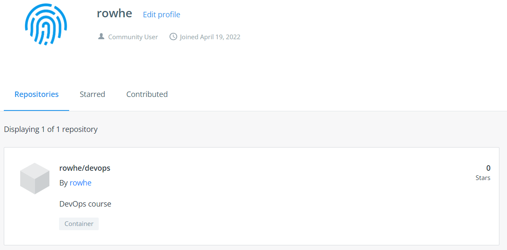

# Домашнее задание к занятию "5.3. Введение. Экосистема. Архитектура. Жизненный цикл Docker контейнера"

## Как сдавать задания

Обязательными к выполнению являются задачи без указания звездочки. Их выполнение необходимо для получения зачета и диплома о профессиональной переподготовке.

Задачи со звездочкой (*) являются дополнительными задачами и/или задачами повышенной сложности. Они не являются обязательными к выполнению, но помогут вам глубже понять тему.

Домашнее задание выполните в файле readme.md в github репозитории. В личном кабинете отправьте на проверку ссылку на .md-файл в вашем репозитории.

Любые вопросы по решению задач задавайте в чате учебной группы.

---

## Задача 1

Сценарий выполения задачи:

- создайте свой репозиторий на https://hub.docker.com;
  * 
- выберете любой образ, который содержит веб-сервер Nginx;
  * 
- создайте свой fork образа;
```shell
vagrant@server1:~$ docker pull nginx
Using default tag: latest
latest: Pulling from library/nginx
1fe172e4850f: Download complete
1fe172e4850f: Pull complete
35c195f487df: Pull complete
213b9b16f495: Pull complete
a8172d9e19b9: Pull complete
f5eee2cb2150: Pull complete
93e404ba8667: Pull complete
Digest: sha256:6d701d83f2a1bb99efb7e6a60a1e4ba6c495bc5106c91709b0560d13a9bf8fb6
Status: Downloaded newer image for nginx:latest
docker.io/library/nginx:latest
vagrant@server1:~$
```
  * Dockerfile
```shell
FROM nginx:latest
RUN rm -fv /usr/share/nginx/html/index.html && \
touch /usr/share/nginx/html/index.html && \
echo '<html> \
<head> \
Hey, Netology \
</head> \
<body> \
<h1>I’m DevOps Engineer!</h1> \
</body> \
</html>' > /usr/share/nginx/html/index.html

```
  * Сборка
```shell
dpopov@dpopov-test:~/virt-homeworks/05-virt-03-docker/nginx$ sudo docker build -t rowhe/nginx:1.21.6 .
Sending build context to Docker daemon  2.048kB
Step 1/2 : FROM nginx:latest
 ---> fa5269854a5e
Step 2/2 : RUN rm -fv /usr/share/nginx/html/index.html && touch /usr/share/nginx/html/index.html && echo '<html> <head> Hey, Netology </head> <body> <h1>I’m DevOps Engineer!</h1> </body> </html>' > /usr/share/nginx/html/index.html
 ---> Running in 2c328dee19d5
removed '/usr/share/nginx/html/index.html'
Removing intermediate container 2c328dee19d5
 ---> 54c071d93d68
Successfully built 54c071d93d68
Successfully tagged rowhe/nginx:1.21.6
dpopov@dpopov-test:~/virt-homeworks/05-virt-03-docker/nginx$ sudo docker run --name my_nginx -d -p 80:80 rowhe/nginx:1.21.6
4c708c7864b0a19a4ca95375d1b341af5d1746e8666e798b7ca2f9fc9a0c06dc
dpopov@dpopov-test:~/virt-homeworks/05-virt-03-docker/nginx$ curl localhost:80
<html> <head> Hey, Netology </head> <body> <h1>I’m DevOps Engineer!</h1> </body> </html>
dpopov@dpopov-test:~/virt-homeworks/05-virt-03-docker/nginx$
```
  * Запуск контейнера
```shell
dpopov@dpopov-test:~/virt-homeworks/05-virt-03-docker/nginx$ sudo docker run --name my_nginx -d -p 80:80 rowhe/nginx:1.21.6
4c708c7864b0a19a4ca95375d1b341af5d1746e8666e798b7ca2f9fc9a0c06dc
dpopov@dpopov-test:~/virt-homeworks/05-virt-03-docker/nginx$ 
```
- реализуйте функциональность:
запуск веб-сервера в фоне с индекс-страницей, содержащей HTML-код ниже:
```
<html>
<head>
Hey, Netology
</head>
<body>
<h1>I’m DevOps Engineer!</h1>
</body>
</html>
```
  * Проверка работы
```shell
dpopov@dpopov-test:~/virt-homeworks/05-virt-03-docker/ansible$ sudo docker ps
CONTAINER ID   IMAGE                   COMMAND                  CREATED             STATUS             PORTS                               NAMES
12ffc48ed796   rowhe/ansible:v.12345   "bash"                   10 minutes ago      Up 10 minutes                                          ansible_12345
2a6332303d02   rowhe/debian:v.12345    "/bin/bash"              About an hour ago   Up About an hour                                       debian_12345
d59dd233b6db   rowhe/centos:v.12345    "/usr/sbin/init"         2 hours ago         Up 2 hours                                             centos_v.12345
4c708c7864b0   rowhe/nginx:1.21.6      "/docker-entrypoint.…"   2 days ago          Up 2 days          0.0.0.0:80->80/tcp, :::80->80/tcp   my_nginx
dpopov@dpopov-test:~/virt-homeworks/05-virt-03-docker/nginx$ curl localhost:80
<html> <head> Hey, Netology </head> <body> <h1>I’m DevOps Engineer!</h1> </body> </html>
dpopov@dpopov-test:~/virt-homeworks/05-virt-03-docker/nginx$ 
```

Опубликуйте созданный форк в своем репозитории и предоставьте ответ в виде ссылки на https://hub.docker.com/username_repo.
  * Ссылка на [репозиторий](https://hub.docker.com/repository/docker/rowhe/nginx) Nginx

## Задача 2

Посмотрите на сценарий ниже и ответьте на вопрос:
"Подходит ли в этом сценарии использование Docker контейнеров или лучше подойдет виртуальная машина, физическая машина? Может быть возможны разные варианты?"

Детально опишите и обоснуйте свой выбор.
--

Сценарий:

- Высоконагруженное монолитное java веб-приложение;
  * Контейнер
- Nodejs веб-приложение;
  * Контейнер
- Мобильное приложение c версиями для Android и iOS;
  * Контейнер
- Шина данных на базе Apache Kafka;
  * Контейнер
- Elasticsearch кластер для реализации логирования продуктивного веб-приложения - три ноды elasticsearch, два logstash и две ноды kibana;
  * Контейнер
- Мониторинг-стек на базе Prometheus и Grafana;
  * Контейнер
- MongoDB, как основное хранилище данных для java-приложения;
  * Отдельный физический сервер или виртуальная машина
- Gitlab сервер для реализации CI/CD процессов и приватный (закрытый) Docker Registry.
  * Виртуальная машина
  * P.S. К сожалению с этими сервисами пока не работал и могу лишь примерно представлять в каком случае лучше использовать контейнер, а в каком виртуальный или физический сервер.

## Задача 3

- Запустите первый контейнер из образа ***centos*** c любым тэгом в фоновом режиме, подключив папку ```/data``` из текущей рабочей директории на хостовой машине в ```/data``` контейнера;
```shell
dpopov@dpopov-test:~/virt-homeworks/05-virt-03-docker/debian$ sudo docker run -v /home/dpopov/virt-homeworks/05-virt-03-docker/data:/data --name centos_v.12345 -d rowhe/centos:v.12345
2e4010cea76360c4ad07d46a29ed7b5e6bf7aad72bc1d242dc6023145a6da959
dpopov@dpopov-test:~/virt-homeworks/05-virt-03-docker/debian$
```
- Запустите второй контейнер из образа ***debian*** в фоновом режиме, подключив папку ```/data``` из текущей рабочей директории на хостовой машине в ```/data``` контейнера;
```shell
dpopov@dpopov-test:~/virt-homeworks/05-virt-03-docker/debian$ sudo docker run --rm -d -it -v /home/dpopov/virt-homeworks/05-virt-03-docker/data:/data --name debian_12345 rowhe/debian:v.12345
2a6332303d0292521ff787dbd573a295dc0d8ac4a93c34110c2f89f97c74d655
dpopov@dpopov-test:~/virt-homeworks/05-virt-03-docker/debian$

```
- Подключитесь к первому контейнеру с помощью ```docker exec``` и создайте текстовый файл любого содержания в ```/data```;
- Добавьте еще один файл в папку ```/data``` на хостовой машине;
- Подключитесь во второй контейнер и отобразите листинг и содержание файлов в ```/data``` контейнера.
```shell
dpopov@dpopov-test:~/virt-homeworks/05-virt-03-docker$ sudo docker exec -it centos_v.12345 bash
[root@d59dd233b6db 05-virt-03-docker]# echo "1234"> /data/added_from_centos.txt
[root@d59dd233b6db 05-virt-03-docker]# exit
dpopov@dpopov-test:~/virt-homeworks/05-virt-03-docker$ sudo docker exec -it debian_12345 bash
root@2a6332303d02:/home/dpopov/virt-homeworks/05-virt-03-docker# echo "1234">/data/added_from_debian.txt
root@2a6332303d02:/home/dpopov/virt-homeworks/05-virt-03-docker# exit
dpopov@dpopov-test:~/virt-homeworks/05-virt-03-docker$ echo "1234">data/added_from_host.txt
dpopov@dpopov-test:~/virt-homeworks/05-virt-03-docker$ ls -al data/
total 20
drwxrwxr-x 2 dpopov dpopov 4096 Apr 24 18:05 .
drwxrwxr-x 8 dpopov dpopov 4096 Apr 24 15:44 ..
-rw-r--r-- 1 root   root      5 Apr 24 18:04 added_from_centos.txt
-rw-r--r-- 1 root   root      5 Apr 24 18:05 added_from_debian.txt
-rw-rw-r-- 1 dpopov dpopov    5 Apr 24 18:05 added_from_host.txt
dpopov@dpopov-test:~/virt-homeworks/05-virt-03-docker$
```
## Задача 4 (*)

Воспроизвести практическую часть лекции самостоятельно.

Соберите Docker образ с Ansible, загрузите на Docker Hub и пришлите ссылку вместе с остальными ответами к задачам.
* Ссылка на репозиторий [ansible](https://hub.docker.com/repository/docker/rowhe/ansible) 
```shell
dpopov@dpopov-test:~/virt-homeworks/05-virt-03-docker/ansible$ sudo docker push rowhe/ansible:v.12345
The push refers to repository [docker.io/rowhe/ansible]
4ea269a2ce2c: Pushed
f7f29e0e4524: Pushed
b401a928648a: Mounted from library/ubuntu
v.12345: digest: sha256:398ab894776a7751adad1e2a09e58649fd788ce25966e9174d8a59aa46876a8b size: 949

```


---

### Как cдавать задание

Выполненное домашнее задание пришлите ссылкой на .md-файл в вашем репозитории.

---
