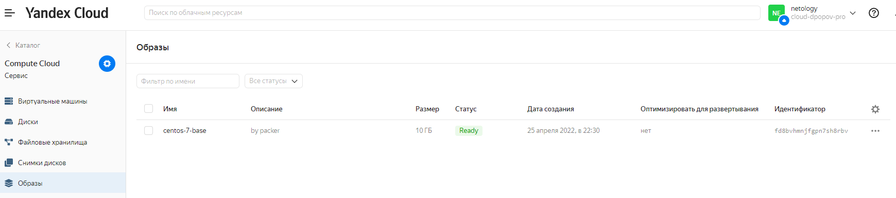
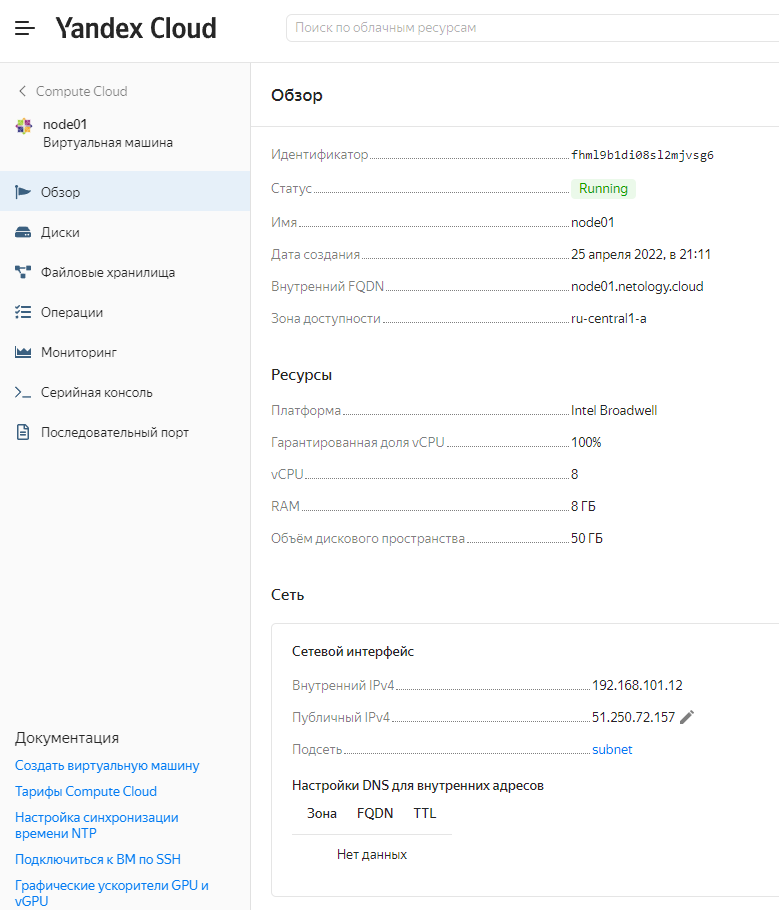
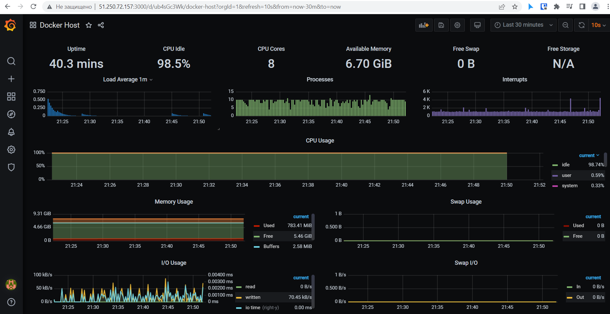

# Домашнее задание к занятию "5.4. Оркестрация группой Docker контейнеров на примере Docker Compose"

## Как сдавать задания

Обязательными к выполнению являются задачи без указания звездочки. Их выполнение необходимо для получения зачета и диплома о профессиональной переподготовке.

Задачи со звездочкой (*) являются дополнительными задачами и/или задачами повышенной сложности. Они не являются обязательными к выполнению, но помогут вам глубже понять тему.

Домашнее задание выполните в файле readme.md в github репозитории. В личном кабинете отправьте на проверку ссылку на .md-файл в вашем репозитории.

Любые вопросы по решению задач задавайте в чате учебной группы.

---

## Задача 1

Создать собственный образ операционной системы с помощью Packer.

Для получения зачета, вам необходимо предоставить:
- Скриншот страницы, как на слайде из презентации (слайд 37).
* Скриншот созданного образа ВМ (идентификатор образа не совпадает со скриншотом ниже, так как пришлось заново создавать образ для скриншота)
<p align="center">
  
</p>

* Вывод команды `ansible-playbook`
```shell
dpopov@dpopov-test:~/virt-homeworks/05-virt-04-docker-compose/src/ansible$ ansible-playbook provision.yml

PLAY [nodes] **********************************************************************************************************************************************************************

TASK [Gathering Facts] ************************************************************************************************************************************************************
The authenticity of host '51.250.72.157 (51.250.72.157)' can't be established.
ECDSA key fingerprint is SHA256:ick4bAXY3WIrP4nGIFtFSvQVnogmM8fS6q3yTwHCvcM.
Are you sure you want to continue connecting (yes/no/[fingerprint])? yes
ok: [node01.netology.cloud]

TASK [Create directory for ssh-keys] **********************************************************************************************************************************************
ok: [node01.netology.cloud]

TASK [Adding rsa-key in /root/.ssh/authorized_keys] *******************************************************************************************************************************
changed: [node01.netology.cloud]

TASK [Checking DNS] ***************************************************************************************************************************************************************
changed: [node01.netology.cloud]

TASK [Installing tools] ***********************************************************************************************************************************************************
changed: [node01.netology.cloud] => (item=['git', 'curl'])

TASK [Add docker repository] ******************************************************************************************************************************************************
changed: [node01.netology.cloud]

TASK [Installing docker package] **************************************************************************************************************************************************
changed: [node01.netology.cloud] => (item=['docker-ce', 'docker-ce-cli', 'containerd.io'])

TASK [Enable docker daemon] *******************************************************************************************************************************************************
changed: [node01.netology.cloud]

TASK [Install docker-compose] *****************************************************************************************************************************************************
changed: [node01.netology.cloud]

TASK [Synchronization] ************************************************************************************************************************************************************
changed: [node01.netology.cloud]

TASK [Pull all images in compose] *************************************************************************************************************************************************
changed: [node01.netology.cloud]

TASK [Up all services in compose] *************************************************************************************************************************************************
changed: [node01.netology.cloud]

PLAY RECAP ************************************************************************************************************************************************************************
node01.netology.cloud      : ok=12   changed=10   unreachable=0    failed=0    skipped=0    rescued=0    ignored=0

dpopov@dpopov-test:~/virt-homeworks/05-virt-04-docker-compose/src/ansible$

```

## Задача 2

Создать вашу первую виртуальную машину в Яндекс.Облаке.

Для получения зачета, вам необходимо предоставить:
- Скриншот страницы свойств созданной ВМ, как на примере ниже:

<p align="center">
  
</p>

## Задача 3

Создать ваш первый готовый к боевой эксплуатации компонент мониторинга, состоящий из стека микросервисов.

Для получения зачета, вам необходимо предоставить:
- Скриншот работающего веб-интерфейса Grafana
<p align="center">
  
</p>

## Задача 4 (*)

Создать вторую ВМ и подключить её к мониторингу развёрнутому на первом сервере.

Для получения зачета, вам необходимо предоставить:
- Скриншот из Grafana, на котором будут отображаться метрики добавленного вами сервера.

