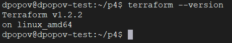
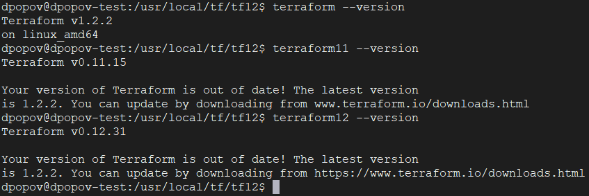

# Домашнее задание к занятию "7.1. Инфраструктура как код"

## Задача 1. Выбор инструментов. 
 
### Легенда
 
Через час совещание на котором менеджер расскажет о новом проекте. Начать работу над которым надо 
будет уже сегодня. 
На данный момент известно, что это будет сервис, который ваша компания будет предоставлять внешним заказчикам.
Первое время, скорее всего, будет один внешний клиент, со временем внешних клиентов станет больше.

Так же по разговорам в компании есть вероятность, что техническое задание еще не четкое, что приведет к большому
количеству небольших релизов, тестирований интеграций, откатов, доработок, то есть скучно не будет.  
   
Вам, как девопс инженеру, будет необходимо принять решение об инструментах для организации инфраструктуры.
На данный момент в вашей компании уже используются следующие инструменты: 
- остатки Сloud Formation, 
- некоторые образы сделаны при помощи Packer,
- год назад начали активно использовать Terraform, 
- разработчики привыкли использовать Docker, 
- уже есть большая база Kubernetes конфигураций, 
- для автоматизации процессов используется Teamcity, 
- также есть совсем немного Ansible скриптов, 
- и ряд bash скриптов для упрощения рутинных задач.  

Для этого в рамках совещания надо будет выяснить подробности о проекте, что бы в итоге определиться с инструментами:

1. Какой тип инфраструктуры будем использовать для этого проекта: изменяемый или не изменяемый?
* Учитывая то, что нет точного ТЗ для будущего проекта и предвидятся множественные изменения, то разумнее было бы использовать неизменяемую архитектуру
с хранением её конфигурации при помощи Git
2. Будет ли центральный сервер для управления инфраструктурой?
* Управление инфраструктурой лучше всего сразу планировать с использованием центрального сервера управления инфраструктурой,
но на первом этапе можно обойтись и без него. Все зависит от возможностей компании и перспектив проекта. 
Необходимо понимать какой гипервизор будет необходимо применить (с учетом имеющейся большой базы kubernetes конфигураций)
3. Будут ли агенты на серверах?
* Использование агентов зависит от используемой системы развертывания инфраструктуры. В нашем случае это Ansible, значит агенты нам не понадобятся.
4. Будут ли использованы средства для управления конфигурацией или инициализации ресурсов?
* В нашем случае средствами управления конфигураций и инициализации ресурсов являются Packer, Terraform, Ansible и Docker
 
В связи с тем, что проект стартует уже сегодня, в рамках совещания надо будет определиться со всеми этими вопросами.


1. Какие инструменты из уже используемых вы хотели бы использовать для нового проекта?
* В проекте можно будет применить все упомянутые инструменты: Packer, Terraform, Ansible, Docker(kubernetes?)
2. Хотите ли рассмотреть возможность внедрения новых инструментов для этого проекта?
* Также в проекте интересно было бы применить DBaaS

Если для ответа на эти вопросы недостаточно информации, то напишите какие моменты уточните на совещании.


## Задача 2. Установка терраформ. 

Официальный сайт: https://www.terraform.io/

Установите терраформ при помощи менеджера пакетов используемого в вашей операционной системе.
В виде результата этой задачи приложите вывод команды `terraform --version`.


## Задача 3. Поддержка легаси кода. 

В какой-то момент вы обновили терраформ до новой версии, например с 0.12 до 0.13.
А код одного из проектов настолько устарел, что не может работать с версией 0.13. 
В связи с этим необходимо сделать так, чтобы вы могли одновременно использовать последнюю версию терраформа установленную при помощи
штатного менеджера пакетов и устаревшую версию 0.12. 

В виде результата этой задачи приложите вывод `--version` двух версий терраформа доступных на вашем компьютере 
или виртуальной машине.



```shell
dpopov@dpopov-test:~/p4$ sudo mkdir -p /usr/local/tf/tf{11..12}
dpopov@dpopov-test:~/p4$ cd /usr/local/tf/tf11/
dpopov@dpopov-test:/usr/local/tf/tf11$ sudo wget https://releases.hashicorp.com/terraform/0.11.15/terraform_0.11.15_linux_amd64.zip
dpopov@dpopov-test:/usr/local/tf/tf11$ sudo unzip terraform_0.11.15_linux_amd64.zip
dpopov@dpopov-test:/usr/local/tf/tf11$ cd ../tf12
dpopov@dpopov-test:/usr/local/tf/tf12$ sudo wget https://releases.hashicorp.com/terraform/0.12.31/terraform_0.12.31_linux_amd64.zip
dpopov@dpopov-test:/usr/local/tf/tf12$ sudo unzip terraform_0.12.31_linux_amd64.zip
dpopov@dpopov-test:/usr/local/tf/tf12$ sudo ln -s /usr/local/tf/tf11/terraform /usr/bin/terraform11
dpopov@dpopov-test:/usr/local/tf/tf12$ sudo ln -s /usr/local/tf/tf12/terraform /usr/bin/terraform12
dpopov@dpopov-test:/usr/local/tf/tf12$ sudo chmod ugo+x /usr/bin/terraform*
dpopov@dpopov-test:/usr/local/tf/tf12$ terraform --version
Terraform v1.2.2
on linux_amd64
dpopov@dpopov-test:/usr/local/tf/tf12$ terraform11 --version
Terraform v0.11.15

Your version of Terraform is out of date! The latest version
is 1.2.2. You can update by downloading from www.terraform.io/downloads.html
dpopov@dpopov-test:/usr/local/tf/tf12$ terraform12 --version
Terraform v0.12.31

Your version of Terraform is out of date! The latest version
is 1.2.2. You can update by downloading from https://www.terraform.io/downloads.html
dpopov@dpopov-test:/usr/local/tf/tf12$

```

* Также интернет гласит, что для версионности `terraform` можно использовать утилиту [tfenv](https://github.com/tfutils/tfenv)
---

### Как cдавать задание

Выполненное домашнее задание пришлите ссылкой на .md-файл в вашем репозитории.

---
