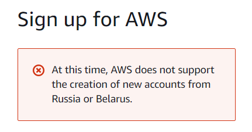
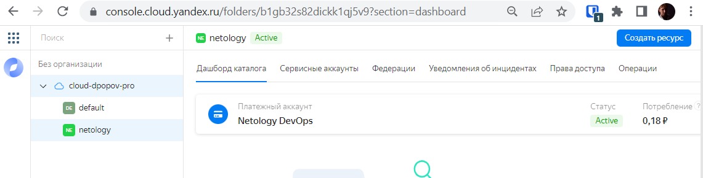

# Домашнее задание к занятию "7.2. Облачные провайдеры и синтаксис Terraform."

Зачастую разбираться в новых инструментах гораздо интересней понимая то, как они работают изнутри. 
Поэтому в рамках первого *необязательного* задания предлагается завести свою учетную запись в AWS (Amazon Web Services) или Yandex.Cloud.
Идеально будет познакомится с обоими облаками, потому что они отличаются. 

## Задача 1 (вариант с AWS). Регистрация в aws и знакомство с основами (необязательно, но крайне желательно).

Остальные задания можно будет выполнять и без этого аккаунта, но с ним можно будет увидеть полный цикл процессов. 

AWS предоставляет достаточно много бесплатных ресурсов в первый год после регистрации, подробно описано [здесь](https://aws.amazon.com/free/).
1. Создайте аккаут aws.
   * К сожалению в данный момент регистрация на AWS затруднительна и задание будет выполнено на примере **Yandex Cloud**
   
   

2. Установите c aws-cli https://aws.amazon.com/cli/.
3. Выполните первичную настройку aws-sli https://docs.aws.amazon.com/cli/latest/userguide/cli-configure-quickstart.html.
4. Создайте IAM политику для терраформа c правами
    * AmazonEC2FullAccess
    * AmazonS3FullAccess
    * AmazonDynamoDBFullAccess
    * AmazonRDSFullAccess
    * CloudWatchFullAccess
    * IAMFullAccess
5. Добавьте переменные окружения 
    ```
    export AWS_ACCESS_KEY_ID=(your access key id)
    export AWS_SECRET_ACCESS_KEY=(your secret access key)
    ```
6. Создайте, остановите и удалите ec2 инстанс (любой с пометкой `free tier`) через веб интерфейс. 

В виде результата задания приложите вывод команды `aws configure list`.

## Задача 1 (Вариант с Yandex.Cloud). Регистрация в ЯО и знакомство с основами (необязательно, но крайне желательно).

1. Подробная инструкция на русском языке содержится [здесь](https://cloud.yandex.ru/docs/solutions/infrastructure-management/terraform-quickstart).
2. Обратите внимание на период бесплатного использования после регистрации аккаунта. 
3. Используйте раздел "Подготовьте облако к работе" для регистрации аккаунта. Далее раздел "Настройте провайдер" для подготовки
базового терраформ конфига.
4. Воспользуйтесь [инструкцией](https://registry.terraform.io/providers/yandex-cloud/yandex/latest/docs) на сайте терраформа, что бы 
не указывать авторизационный токен в коде, а терраформ провайдер брал его из переменных окружений.

   * Регистрируемся в облаке **Yandex Cloud**




   * Устанавливаем переменные окружения `TF_VAR_yc_token`  `TF_VAR_yc_cloud_id` `TF_VAR_yc_folder_id` `TF_VAR_yc_region` <br>
   **или** `YC_TOKEN` `YC_CLOUD_ID` `YC_FOLDER_ID` `YC_ZONE` в системе с `terraform`

```shell
export TF_VAR_yc_token=bla-bla-bla
export TF_VAR_yc_cloud_id=bla-bla-bla
export TF_VAR_yc_folder_id=bla-bla-bla
export TF_VAR_yc_region=ru-central1-a
```

## Задача 2. Создание aws ec2 или yandex_compute_instance через терраформ. 

1. В каталоге `terraform` вашего основного репозитория, который был создан в начале курсе, создайте файл `main.tf`
   
   * создаем каталог `terraform` и необходимые файлы
   
```shell
   mkdir terraform && cd terraform
   touch main.tf  
```
   * Настраиваем `.terraformrc` 
   
   ```shell
   provider_installation {
     network_mirror {
       url = "https://terraform-mirror.yandex.cloud.net"
       include = ["registry.terraform.io/*/*"]
     }
     direct {
       exclude = ["registry.terraform.io/*/*"]
     }
   }
   ```
   
   1. Зарегистрируйте провайдер 
      1. для [aws](https://registry.terraform.io/providers/hashicorp/aws/latest/docs). В файл `main.tf` добавьте
      блок `provider`, а в `versions.tf` блок `terraform` с вложенным блоком `required_providers`. Укажите любой выбранный вами регион 
      внутри блока `provider`.
      2. либо для [yandex.cloud](https://registry.terraform.io/providers/yandex-cloud/yandex/latest/docs). Подробную инструкцию можно найти 
      [здесь](https://cloud.yandex.ru/docs/solutions/infrastructure-management/terraform-quickstart).
      
      * Регистрируем провайдер `yandex` в файле main.tf
   ```shell
    terraform {
     required_providers {
       yandex = {
       source = "yandex-cloud/yandex"
       }
     }
    required_version = ">=0.13"
    }
   provider "yandex" {
     token     = var.yc_token
     cloud_id  = var.yc_cloud_id
      zone      = var.yc_region
   }
  ```

   3. Внимание! В гит репозиторий нельзя пушить ваши личные ключи доступа к аккаунту. Поэтому в предыдущем задании мы указывали
   их в виде переменных окружения. 
   1. В файле `main.tf` воспользуйтесь блоком `data "aws_ami` для поиска ami образа последнего Ubuntu.
   2. В файле `main.tf` создайте ресурс 
      1. либо [ec2 instance](https://registry.terraform.io/providers/hashicorp/aws/latest/docs/resources/instance).
      Постарайтесь указать как можно больше параметров для его определения. Минимальный набор параметров указан в первом блоке 
      `Example Usage`, но желательно, указать большее количество параметров.
      2. либо [yandex_compute_image](https://registry.terraform.io/providers/yandex-cloud/yandex/latest/docs/resources/compute_image).
      * Описываем свойства `yandex_compute_image`
   ```shell
    resource "yandex_compute_image" "my_image" {
    description   = "Test image"
    source_family = "ubuntu-2004-lts"
    folder_id     = var.yc_folder_id
    min_disk_size = 10
    os_type       = "linux"
    }
   ```
   * Запускаем `terraform apply` и проверяем, что образ появился в хранилище
   
```shell
  dpopov@dpopov-test:~/virt-homeworks/07-terraform-02-syntax/terraform$ terraform apply

Terraform used the selected providers to generate the following execution plan. Resource actions are indicated with the following symbols:
  + create

Terraform will perform the following actions:

  # yandex_compute_image.my_image will be created
  + resource "yandex_compute_image" "my_image" {
      + created_at      = (known after apply)
      + folder_id       = "b1gb32s82dickk1qj5v9"
      + id              = (known after apply)
      + min_disk_size   = 10
      + os_type         = (known after apply)
      + pooled          = (known after apply)
      + product_ids     = (known after apply)
      + size            = (known after apply)
      + source_disk     = (known after apply)
      + source_family   = "ubuntu-2004-lts"
      + source_image    = (known after apply)
      + source_snapshot = (known after apply)
      + source_url      = (known after apply)
      + status          = (known after apply)
    }

Plan: 1 to add, 0 to change, 0 to destroy.

Do you want to perform these actions?
  Terraform will perform the actions described above.
  Only 'yes' will be accepted to approve.

  Enter a value: yes

yandex_compute_image.my_image: Creating...
yandex_compute_image.my_image: Still creating... [10s elapsed]
yandex_compute_image.my_image: Creation complete after 12s [id=fd81qm2ppom08uk1s313]

Apply complete! Resources: 1 added, 0 changed, 0 destroyed.
dpopov@dpopov-test:~/virt-homeworks/07-terraform-02-syntax/terraform$ yc compute image list
+----------------------+------+--------+----------------------+--------+
|          ID          | NAME | FAMILY |     PRODUCT IDS      | STATUS |
+----------------------+------+--------+----------------------+--------+
| fd81qm2ppom08uk1s313 |      |        | f2e8tnsqjeor74blquqc | READY  |
+----------------------+------+--------+----------------------+--------+

dpopov@dpopov-test:~/virt-homeworks/07-terraform-02-syntax/terraform$
   ```

6. Также в случае использования aws:
   1. Добавьте data-блоки `aws_caller_identity` и `aws_region`.
   2. В файл `outputs.tf` поместить блоки `output` с данными об используемых в данный момент: 
       * AWS account ID,
       * AWS user ID,
       * AWS регион, который используется в данный момент, 
       * Приватный IP ec2 инстансы,
       * Идентификатор подсети в которой создан инстанс.  
7. Если вы выполнили первый пункт, то добейтесь того, что бы команда `terraform plan` выполнялась без ошибок.  


В качестве результата задания предоставьте:
1. Ответ на вопрос: при помощи какого инструмента (из разобранных на прошлом занятии) можно создать свой образ ami?
    * Образы для AWS и Yandex Cloud можно создавать при помощи **Packer** от [HashiCorp](https://https://www.packer.io/)
2. Ссылку на репозиторий с исходной конфигурацией терраформа.
    * Проверить использованную конфигурацию **Terraform** можно по этой  [Ссылке](https://github.com/rowhe/virt-homeworks/blob/3b8155127a66bb6a7b40d2cfee5a21835137f061/07-terraform-02-syntax/terraform/main.tf)
    * Созданиe, проверка и удаление образа и виртуальной машины
```shell
dpopov@dpopov-test:~/virt-homeworks/07-terraform-02-syntax/terraform$ terraform apply

Terraform used the selected providers to generate the following execution plan. Resource actions are indicated with the following symbols:
  + create
  
  ---
  
yandex_vpc_network.test_network: Creating...
yandex_compute_image.my_image: Creating...
yandex_vpc_network.test_network: Creation complete after 1s [id=enppr3fegke2t98ka0qn]
yandex_vpc_subnet.subnet192: Creating...
yandex_vpc_subnet.subnet192: Creation complete after 1s [id=e9bcuipfasro8sj04pea]
yandex_compute_instance.virt_machine: Creating...
yandex_compute_image.my_image: Creation complete after 6s [id=fd8t5gu9nnecdald6v68]
yandex_compute_instance.virt_machine: Still creating... [10s elapsed]
yandex_compute_instance.virt_machine: Still creating... [20s elapsed]
yandex_compute_instance.virt_machine: Creation complete after 21s [id=fhmg1fs6lbg819djr511]

Apply complete! Resources: 4 added, 0 changed, 0 destroyed.
       dpopov@dpopov-test:~/virt-homeworks/07-terraform-02-syntax/terraform$ yc compute image list
+----------------------+------+--------+----------------------+--------+
|          ID          | NAME | FAMILY |     PRODUCT IDS      | STATUS |
+----------------------+------+--------+----------------------+--------+
| fd8t5gu9nnecdald6v68 |      |        | f2e8tnsqjeor74blquqc | READY  |
+----------------------+------+--------+----------------------+--------+

      dpopov@dpopov-test:~/virt-homeworks/07-terraform-02-syntax/terraform$ yc compute instance list
+----------------------+-----------+---------------+---------+---------------+-------------+
|          ID          |   NAME    |    ZONE ID    | STATUS  |  EXTERNAL IP  | INTERNAL IP |
+----------------------+-----------+---------------+---------+---------------+-------------+
| fhmg1fs6lbg819djr511 | banzai-vm | ru-central1-a | RUNNING | 51.250.94.103 | 192.168.0.8 |
+----------------------+-----------+---------------+---------+---------------+-------------+

dpopov@dpopov-test:~/virt-homeworks/07-terraform-02-syntax/terraform$ terraform destroy
yandex_compute_image.my_image: Refreshing state... [id=fd8t5gu9nnecdald6v68]
yandex_vpc_network.test_network: Refreshing state... [id=enppr3fegke2t98ka0qn]
yandex_vpc_subnet.subnet192: Refreshing state... [id=e9bcuipfasro8sj04pea]
yandex_compute_instance.virt_machine: Refreshing state... [id=fhmg1fs6lbg819djr511]

Terraform used the selected providers to generate the following execution plan. Resource actions are indicated with the following symbols:
  - destroy
  
  ---
  
yandex_compute_image.my_image: Destroying... [id=fd8t5gu9nnecdald6v68]
yandex_compute_instance.virt_machine: Destroying... [id=fhmg1fs6lbg819djr511]
yandex_compute_image.my_image: Destruction complete after 5s
yandex_compute_instance.virt_machine: Still destroying... [id=fhmg1fs6lbg819djr511, 10s elapsed]
yandex_compute_instance.virt_machine: Destruction complete after 11s
yandex_vpc_subnet.subnet192: Destroying... [id=e9bcuipfasro8sj04pea]
yandex_vpc_subnet.subnet192: Destruction complete after 6s
yandex_vpc_network.test_network: Destroying... [id=enppr3fegke2t98ka0qn]
yandex_vpc_network.test_network: Destruction complete after 0s

Destroy complete! Resources: 4 destroyed.
dpopov@dpopov-test:~/virt-homeworks/07-terraform-02-syntax/terraform$
```
---

### Как cдавать задание

Выполненное домашнее задание пришлите ссылкой на .md-файл в вашем репозитории.

---


