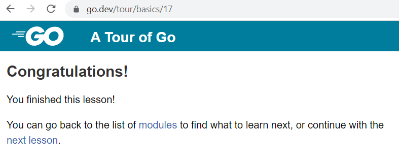

# Домашнее задание к занятию "7.5. Основы golang"

С `golang` в рамках курса, мы будем работать не много, поэтому можно использовать любой IDE. 
Но рекомендуем ознакомиться с [GoLand](https://www.jetbrains.com/ru-ru/go/).  

## Задача 1. Установите golang.
1. Воспользуйтесь инструкций с официального сайта: [https://golang.org/](https://golang.org/).
    * Устанавливаем golang
    ```shell
    dpopov@dpopov-test:~$ sudo apt install golang
    [sudo] password for dpopov:
    Reading package lists... Done
    Building dependency tree... Done
    Reading state information... Done
    dpopov@dpopov-test:~$
    ...
    ```
2. Так же для тестирования кода можно использовать песочницу: [https://play.golang.org/](https://play.golang.org/).

## Задача 2. Знакомство с gotour.
У Golang есть обучающая интерактивная консоль [https://tour.golang.org/](https://tour.golang.org/). 
Рекомендуется изучить максимальное количество примеров. В консоли уже написан необходимый код, 
осталось только с ним ознакомиться и поэкспериментировать как написано в инструкции в левой части экрана.


*   Читаем учебник



## Задача 3. Написание кода. 
Цель этого задания закрепить знания о базовом синтаксисе языка. Можно использовать редактор кода 
на своем компьютере, либо использовать песочницу: [https://play.golang.org/](https://play.golang.org/).

1. Напишите программу для перевода метров в футы (1 фут = 0.3048 метр). Можно запросить исходные данные 
у пользователя, а можно статически задать в коде.
    Для взаимодействия с пользователем можно использовать функцию `Scanf`:
    ```
    package main
    
    import "fmt"
    
    func main() {
        fmt.Print("Enter a number: ")
        var input float64
        fmt.Scanf("%f", &input)
    
        output := input * 2
    
        fmt.Println(output)    
    }
    ```
    * Дорабатываем [программу](https://github.com/rowhe/virt-homeworks/blob/0e516b1cf1588c53d10625df16c3a0562974aceb/07-terraform-05-golang/feet.go) для перевода метров в футы

    строку:
    ```shell
    output := input * 2
    ```
    меняем на:
    ```shell
    output := input * 2
    ```
    Запускаем:
    ```shell
        dpopov@dpopov-test:~/go$ go run feet.go
        Lets convert meters to feet!
        Enter number of meters: 3.5
        1.0668
        dpopov@dpopov-test:~/go$
    ```
    Успех!


2. Напишите программу, которая найдет наименьший элемент в любом заданном списке, например:
    ```
    x := []int{48,96,86,68,57,82,63,70,37,34,83,27,19,97,9,17,}
    ```
   * Такая [программа](https://github.com/rowhe/virt-homeworks/blob/0e516b1cf1588c53d10625df16c3a0562974aceb/07-terraform-05-golang/small.go) может выглядеть следующим образом:
    ```shell
    package main
    
    import (
      "fmt"
      "sort"
    )
    
    func main() {
      x := []int{48,96,86,68,57,82,63,70,37,34,83,27,19,97,9,17,}
      sort.Ints(x)
      fmt.Println(x[0])
    }
    
    ```
3. Напишите программу, которая выводит числа от 1 до 100, которые делятся на 3. То есть `(3, 6, 9, …)`.

    * Программа для вывода чисел делимых на 3 без остатка в диапазоне от 1 до 100 может выглядеть [так](https://github.com/rowhe/virt-homeworks/blob/0e516b1cf1588c53d10625df16c3a0562974aceb/07-terraform-05-golang/range.go):
```shell
package main

import "fmt"

func main() {
  for i := 1; i<=100; i++ {
    if (i%3) == 0 {
        fmt.Println(i)
    }
  }
}

```

В виде решения ссылку на код или сам код. 

## Задача 4. Протестировать код (не обязательно).

Создайте тесты для функций из предыдущего задания. 

---

### Как cдавать задание

Выполненное домашнее задание пришлите ссылкой на .md-файл в вашем репозитории.

---

